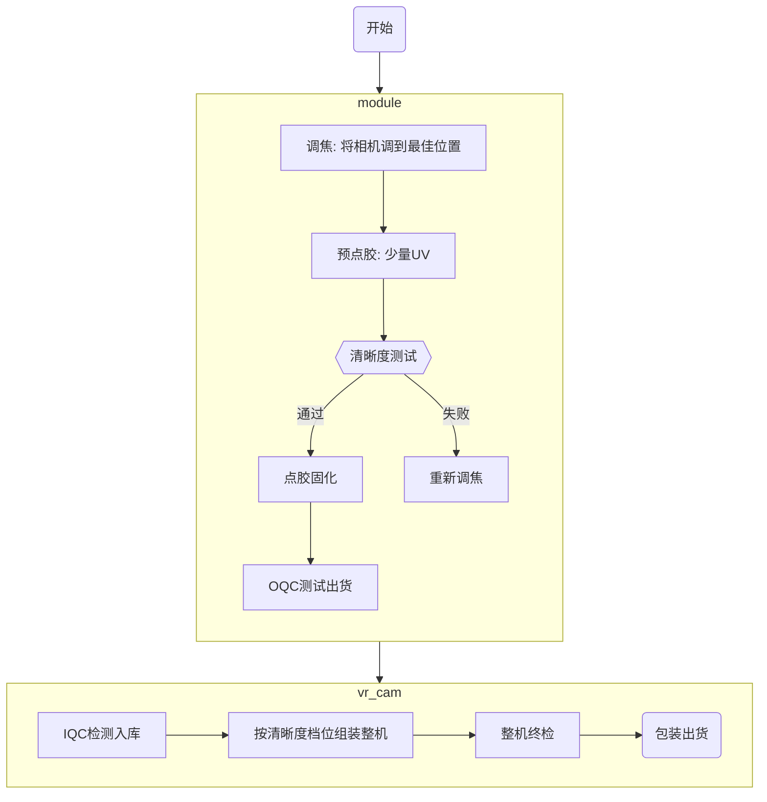

---
{"dg-publish":true,"dg-home":false,"permalink":"/1. 项目/清晰度检测/相机清晰度检测方案/","dgPassFrontmatter":true,"created":"2024-09-18T00:27:07.000+08:00","updated":"2024-09-18T20:07:56.017+08:00"}
---

# 需求

1. 左右目的清晰度相差在一定范围内，不能让人看着有明显的差异。

# 可行方案

为了尽量减少对整机生产良率带来的影响，在调焦阶段，对相机模组进行分档A,B,C,D，其中A,B,C代表着清晰度高中低，但均为合格品；D代表不合格品。

模组组装点胶进行测试后，对模组进行分档。整机组装阶段，按照分档进行搭配组装成整机。



## 方案依赖

### 调焦&测试

模组厂的调焦和测试工位使用同一套治具，有如下依赖：
- 软件设置相机的曝光和增益参数，拿图，调用计算库，出结果
- 员工根据结果进行操作
- 测试板
	- 如果使用现有的出图盒子：需要SDK，基于SDK开发GUI工具，要能支持设置曝光和增益，取图和显示。
	- 如果使用3588的板子：需要开发板子与上位机通信协议，支持曝光和增益设置，支持取图；基于协议开发GUI工具，要能支持设置曝光和增益，取图和显示。

### IQC & OQC

设置曝光和增益，取图，调用计算库，显示出结果，判定清晰度等级。

### 整机清晰度

使用特定ISP配置，设置曝光和增益，取图，调用计算库，显示出结果，判定清晰度是否达标。

```ad-warning
title: 整机清晰度测试不同点

整机清晰度测试需要使用对应SoC平台的ISP，因此相关的效果或阈值会跟使用度信盒子的不同，需要对阈值对标后，确认新的阈值。

```

## 方案评估

针对清晰度的两种实现方案，评估如下：

|            | 方案A: 类度信盒子                                                                                        | 方案B: 3588板子（PC上位机）                                                                                         | 方案C: 3588板子（板端判断清晰度）                                                                                                                            |
| ---------- | :------------------------------------------------------------------------------------------------ | ---------------------------------------------------------------------------------------------------------- | ----------------------------------------------------------------------------------------------------------------------------------------------- |
| 对下位机的依赖    | 需要盒子对应的SDK，SDK需包含如下接口：<br>1. 设置相机的曝光和增益参数<br>2. 获取RAW图                                            | 需要3588主板支持与上位机的通信协议（通常为USB），协议需包含如下接口：<br>1. 设置相机的曝光和增益参数<br>2. 获取RAW或经过特定ISP配置处理过的PNG图                    | 与相机的控制接口需包含：<br>1. 设置相机的曝光和增益参数，或调用或特定ISP配置<br>2. 获取RAW或经过特定ISP配置处理过的PNG<br>3. 需提供3588交叉编译环境                                                    |
| 对上位机的依赖    | 上位机需完成：<br>1. 与下位机接口的打通<br>2. 曝光增益的设置<br>3. 获取RAW图<br>4. 调用动态库进行清晰度计算；<br>5. 将计算结果及时显示出来。         | 上位机需完成：<br>1. 与下位机接口的打通<br>2. 曝光增益的设置<br>3. 获取RAW图<br>4. 调用动态库进行清晰度计算；<br>5. 将计算结果及时显示出来。                  | 该部分仍在3588板子上进行开发，需完成的功能：<br>1. 曝光增益的设置<br>2. 获取RAW图<br>3. 调用动态库进行清晰度计算；<br>4. 将计算结果及时显示出来。<br>另外，3588平台需支持opencv库的调用。                           |
| 清晰度检测算法    | 清晰度检测算法基于windows开发平台，需完成如下工作：<br>1. 对RAW进行相关的ISP处理；<br>2. 识别到对应视场的梯形图刀口位置；<br>3. 计算相应的SFR值，并输出结果。 | 清晰度检测算法基于windows开发平台，需完成如下工作：<br>1. 对RAW进行相关的ISP处理或直接使用PNG图；<br>2. 识别到对应视场的梯形图刀口位置；<br>3. 计算相应的SFR值，并输出结果。 | 清晰度检测算法基于3588 Linux开发平台，需完成如下工作：<br>1. 对RAW进行相关的ISP处理或直接使用PNG图；<br>2. 识别到对应视场的梯形图刀口位置；<br>3. 计算相应的SFR值，并输出结果。<br>另外，清晰度检测算法需要适配3588 Linux交叉编译平台 |
| 清晰度检测算法工作量 | 5人天                                                                                               | 5人天                                                                                                        | 9人天                                                                                                                                             |
| 上位机开发工作量   | 3人天                                                                                               | 3人天                                                                                                        | 需3588开发人员投入                                                                                                                                     |

## 其他注意事项

### 胶缩补偿

相机模组点胶后，会有一定的胶缩量，模组需要在清晰度调焦时，做最佳点的不同离焦量的DOE验证，确认最佳的调焦位置；通常来讲：以最清晰的位置为0°，对-180°，-90°，-45°，0°，45°，90°，180°等位置进行点胶，点胶后进行清晰度测试，对比不同DOE组合相机模组最终的清晰度，以确认最佳的点胶位置。

### 可靠性

模组厂进行双85、随机振动等可靠性验证，测试清晰度变化量，模拟用户长时间使用的场景，确保在用户端没有致命设计缺陷。


